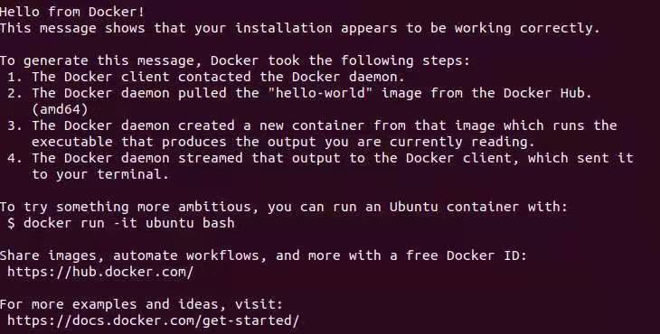
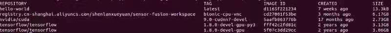
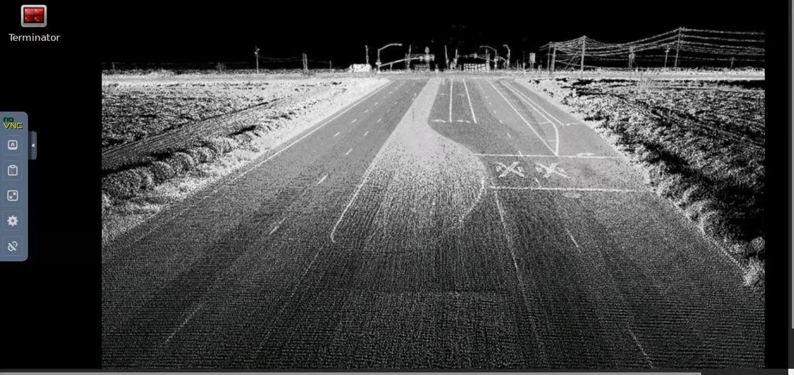
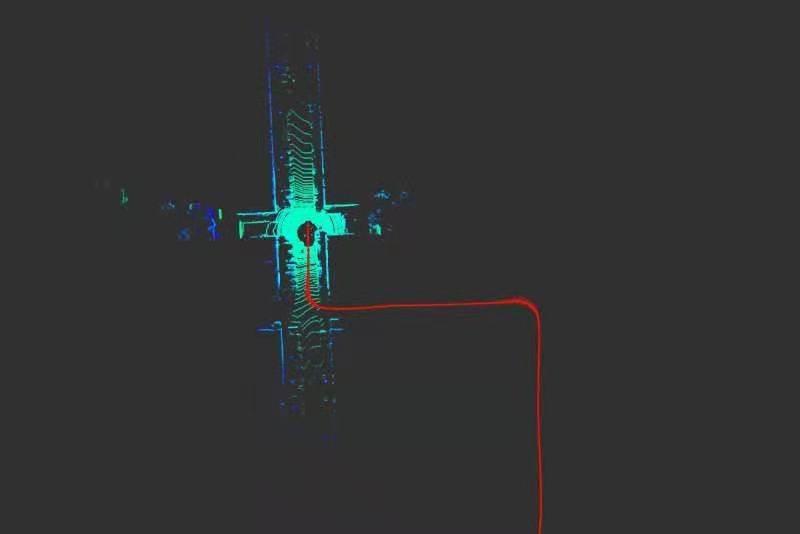

# Multi-Sensor Fusion for Localization & Mapping -- 多传感器融合定位与建图: Introduction

深蓝学院多传感器融合定位与建图第1节Environment Setup作业提示.

---

## Overview

本提示旨在引导您:

* 正确配置环境
* 熟悉教学框架

---

## Introduction

各位同学好, 很荣幸跟大家分享第一次作业. 任务主要是环境的搭建. 大家问题最多的是docker环境的配置. 首先我对docker做个简单介绍.

---

## Docker

首先我们一起了解Docker的几个基本概念:

1. Docker镜像(Docker Image)类似于虚拟机镜像(Virtual Machine Image), 是一个特殊的文件系统, 是创建Docker实例(Docker Instance)的模板.
2. 容器可看作应用程序(Application), 以及应用程序所需的环境依赖(Run-time Dependency)打包而成的盒子(Container).
3. Docker仓库(Docker Registry)是集中存放镜像文件的场所, 如Docker Hub. 国内的阿里云, 腾讯云也提供了Docker仓库. 本课程所用的镜像存放在阿里云仓库中.

Docker Image与Docker Instance的关系可以类比为:

1. 面向对象设计中(Object-Oriented Design)的类(Class)和实例(Instance). 镜像是静态的定义, 容器是镜像运行的实体。
2. Windows平台下的exe和运行exe后产生的进程. 

使用Docker进行开发的好处有:

1. 将运行时环境也加入版本控制系统, 即所谓的Infrastructure as Code.
2. 可通过Dockerfile完成Runtime Dependency的精确控制, 保证环境的一致性(Consistency).

---

## Docker: Up & Running

下面我们来看下docker环境配置:

1. Docker的安装请参考Official Guide: https://docs.docker.com/engine/install/ubuntu/, 运行sudo docker run hello-world可测试是否安装成功. 成功运行后结果如下图所示:

    

    这里`特别注意`, 安装完成后将, 务必当前用户加入Docker Group以免在执行docker命令时加sudo, 所需命令如下:

    ```bash
    sudo usermod -aG docker $USER
    ```

    然后进行如下操作, 使改动生效:

    1. Logout, then Login
    2. Reboot

2. 获取镜像

    1. 首先登录仓库：docker login --username=937570601@qq.com registry.cn-shanghai.aliyuncs.com
    2. 然后拉取镜像：docker pull registry.cn-shanghai.aliyuncs.com/shenlanxueyuan/sensor-fusion-workspace:bionic-cpu-vnc
    3. 运行docker images可检查是否下载成功. 成功运行后结果如下图所示:

    

3. 创建实例. 创建容器的方法有两种: 
    
    1. 第一种是直接用命令行
        ```bash
        docker run -it -v /path/content:/var/lib/content ubuntu /bin/bash
        ```
        
        其中:
        
        1. -v表示文件夹挂载
        2. /bin/bash表示以命令行模式进入
        
    2. 第二种是采用docker-compose的方法，它的方便之处在于可以利用yml配置文件记录容器启动命令参数. docker-compose的安装请参考官方引导: https://docs.docker.com/compose/install/. 安装好之后:
        1. 将任务1提供的压缩文件解压缩到本地
        2. 进入docker-compose.yml文件所在目录
        3. 在终端运行
        
            ```bash
            docker-compose down && docker-compose up
            ```
            
            启动成功后，在浏览器中, 输入地址`http://localhost:40080/`，默认登录密码为`sensorfusion`，即可通过VNC方式访问容器。

            

    这里注意一点，有的同学可能出现文件夹无法挂载的情况，这是由于无法获取环境变量$PWD导致的，该变量指代的是当前工作路径，最简单的解决方法是将yml文件中的$PWD改为`.`

至此, Docker环境的配置就完成了.

---

## ROS: Up & Running

最后是对作业程序的编译, 它本质上是对一个`ros package`的编译. 

1. 首先执行命令如下:

    ```bash
    cd /workspace/assignments/01-introduction && catkin_make
    ```

2. 编译成功后, 运行如下命令启动程序

    ```bash
    source devel/setup.bash && roslaunch lidar_localization hello_kitti.launch
    ```

3. 最后进入到提前下载好的kitti数据集目录, 运行如下命令, 即可播放ROS bag:

    ```bash
    rosbag play kitti_lidar_only_2011_10_03_drive_0027_synced.bag
    ```
    
    订阅到激光等传感器话题后, rviz即可显示轨迹和当前点云数据.

    
---

## Wrap-Up

我的分享结束了，谢谢大家！@班主任-图南南
