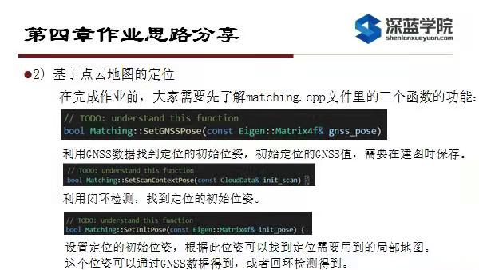
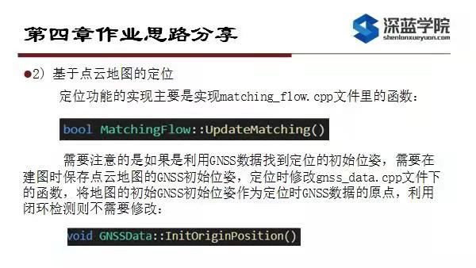

# Multi-Sensor Fusion for Localization & Mapping -- 多传感器融合定位与建图: Mapping & Matching

深蓝学院多传感器融合定位与建图第4节Mapping & Matching作业提示.

---

## Overview

本提示旨在引导您:

* 正确补全相关代码

---

## Introduction

各位同学好, 很荣幸跟大家分享第四次作业的思路. 第四章作业整体是相对比较简单的. 此处存在的问题主要是g2o版本的问题, 需要回退至[此版本](https://github.com/RainerKuemmerle/g2o/releases/tag/20200410_git)才可保证与其他依赖的兼容性. 此处先给大家赔个不是, 会在工作闲些时重新更新一遍环境并发布.

---

## Mapping

在建图环节,只需要按照框架README中的步骤, 就可以保存点云地图. 

在完成定位作业前，大家需要先了解matching.cpp文件里的三个函数功能

---

## Matching

接下来可以在matching_flow.cpp文件里的函数实现定位功能:

---

## Wrap-Up

好了，第四章作业思路分享到此结束，祝大家学习愉快, 成功全优结业, 收获理想的Offer!
