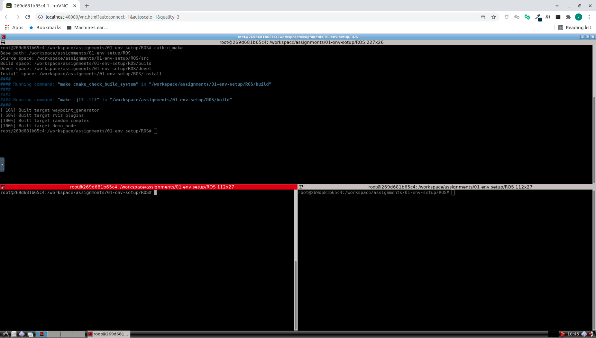
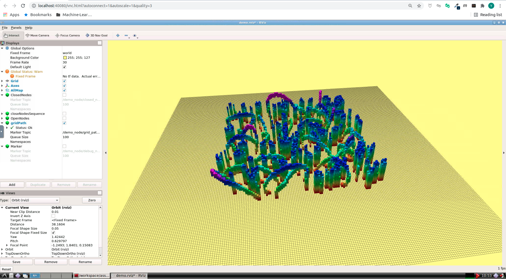

# Motion Planning for Mobile Robots -- 移动机器人运动规划: Introduction

深蓝学院移动机器人运动规划第1节Environment Setup作业框架.

---

## Overview

本作业旨在引导您:

* 验证课程作业开发环境配置的正确性

---

## Getting Started

启动Docker后, 打开浏览器, 前往localhost:40080, 进入Web Workspace. **若需要提高清晰度, 可以更改URL中的quality参数**. 启动Terminator, 将两个Shell的工作目录切换如下:



在**上侧**的Shell中, 输入如下命令, **编译catkin_workspace**

```bash
# build
catkin_make
```

在**下方左侧**的Shell中, 输入如下命令, **Launch ROS Core**

```bash
# set up session:
source devel/setup.bash
# launch roscore
roscore
```

在**下方右侧**的Shell中, 输入如下命令, **Launch RViz**

```bash
# set up session:
source devel/setup.bash
# launch rviz
rviz
```

然后**启动解决方案**

```bash
# set up session:
source devel/setup.bash
# launch demo view:
roslaunch grid_path_searcher demo.launch  
```

成功后, 可以看到如下的RViz界面:

