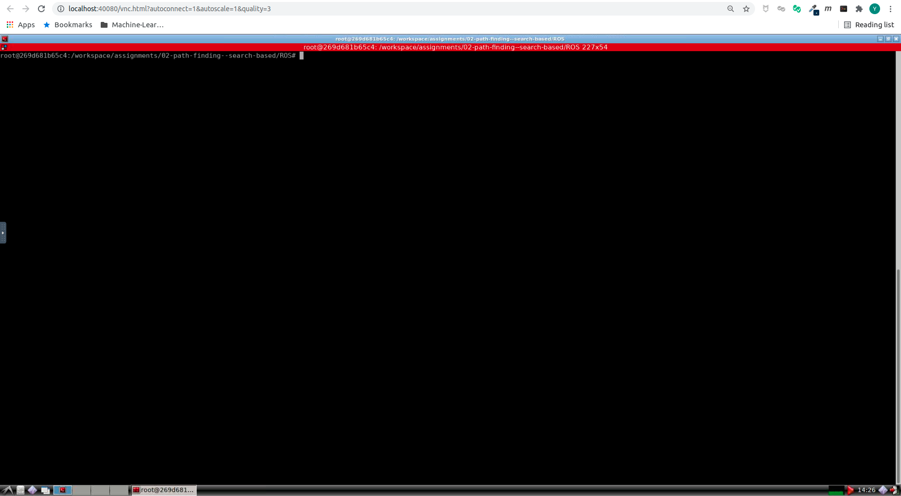
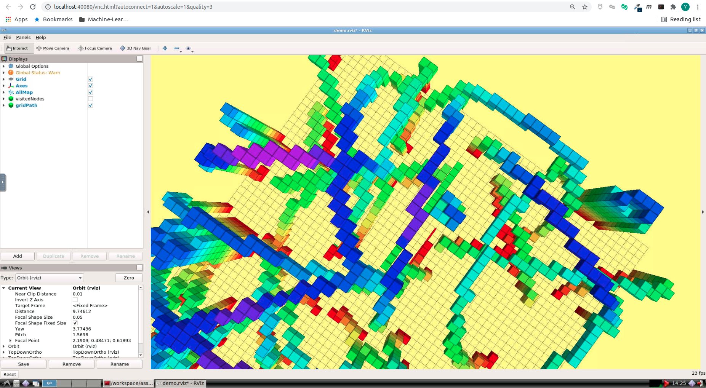
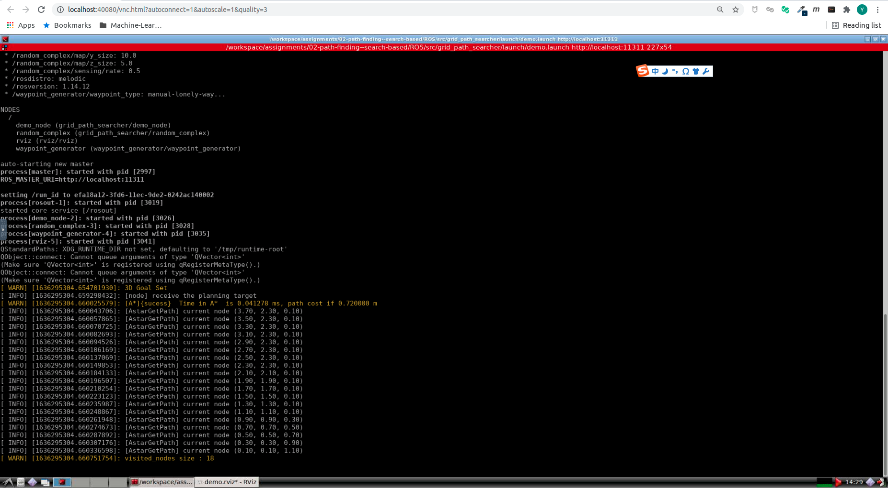

# Motion Planning for Mobile Robots -- 移动机器人运动规划: Path Finding, Search Based

深蓝学院移动机器人运动规划第2节Path Finding, Search Based作业框架.

---

## Overview

本作业旨在引导您:

* 实现A* Path Finding

---

## Up & Running

启动Docker后, 打开浏览器, 前往localhost:40080, 进入Web Workspace. **若需要提高清晰度, 可以更改URL中的quality参数**. 启动Terminator, 将两个Shell的工作目录切换如下:



在**上侧**的Shell中, 输入如下命令, **编译Search Based Path Finder**

```bash
# build
catkin_make
```

然后**启动解决方案**

```bash
# launch:
roslaunch grid_path_searcher demo.launch
```

最后, 点击**3D Nav Goal**, 发布**Termination Position**, 成功后, 可以看到如下的RViz界面:



---

## Q1. 算法流程与运行结果

### A Star

**A Star**的运行结果如下, 结果为使用L2 Heuristics的结果



算法流程如下:

* [Step 1: Get Heuristics](https://github.com/AlexGeControl/Motion-Planning-for-Mobile-Robots/blob/206a2ba1076c6c7b2765fafb4f13801730941d74/workspace/assignments/02-path-finding--search-based/ROS/src/grid_path_searcher/src/Astar_searcher.cpp#L193)
* [Step 2: Initialization](https://github.com/AlexGeControl/Motion-Planning-for-Mobile-Robots/blob/206a2ba1076c6c7b2765fafb4f13801730941d74/workspace/assignments/02-path-finding--search-based/ROS/src/grid_path_searcher/src/Astar_searcher.cpp#L244)
* [Step 3: Expand Current Node](https://github.com/AlexGeControl/Motion-Planning-for-Mobile-Robots/blob/206a2ba1076c6c7b2765fafb4f13801730941d74/workspace/assignments/02-path-finding--search-based/ROS/src/grid_path_searcher/src/Astar_searcher.cpp#L252)
* [Step 4: Get Successors](https://github.com/AlexGeControl/Motion-Planning-for-Mobile-Robots/blob/206a2ba1076c6c7b2765fafb4f13801730941d74/workspace/assignments/02-path-finding--search-based/ROS/src/grid_path_searcher/src/Astar_searcher.cpp#L270)
* [Step 5: Process Candidate Successor](https://github.com/AlexGeControl/Motion-Planning-for-Mobile-Robots/blob/206a2ba1076c6c7b2765fafb4f13801730941d74/workspace/assignments/02-path-finding--search-based/ROS/src/grid_path_searcher/src/Astar_searcher.cpp#L275)
* [Step 6: Insert New Node](https://github.com/AlexGeControl/Motion-Planning-for-Mobile-Robots/blob/206a2ba1076c6c7b2765fafb4f13801730941d74/workspace/assignments/02-path-finding--search-based/ROS/src/grid_path_searcher/src/Astar_searcher.cpp#L290)
* [Step 7: Update Existing Node](https://github.com/AlexGeControl/Motion-Planning-for-Mobile-Robots/blob/206a2ba1076c6c7b2765fafb4f13801730941d74/workspace/assignments/02-path-finding--search-based/ROS/src/grid_path_searcher/src/Astar_searcher.cpp#L301)
* [Step 4: Get Result Path](https://github.com/AlexGeControl/Motion-Planning-for-Mobile-Robots/blob/206a2ba1076c6c7b2765fafb4f13801730941d74/workspace/assignments/02-path-finding--search-based/ROS/src/grid_path_searcher/src/Astar_searcher.cpp#L349)

---

## Q2. 对比不同启发式函数对A Star运行结果的影响

