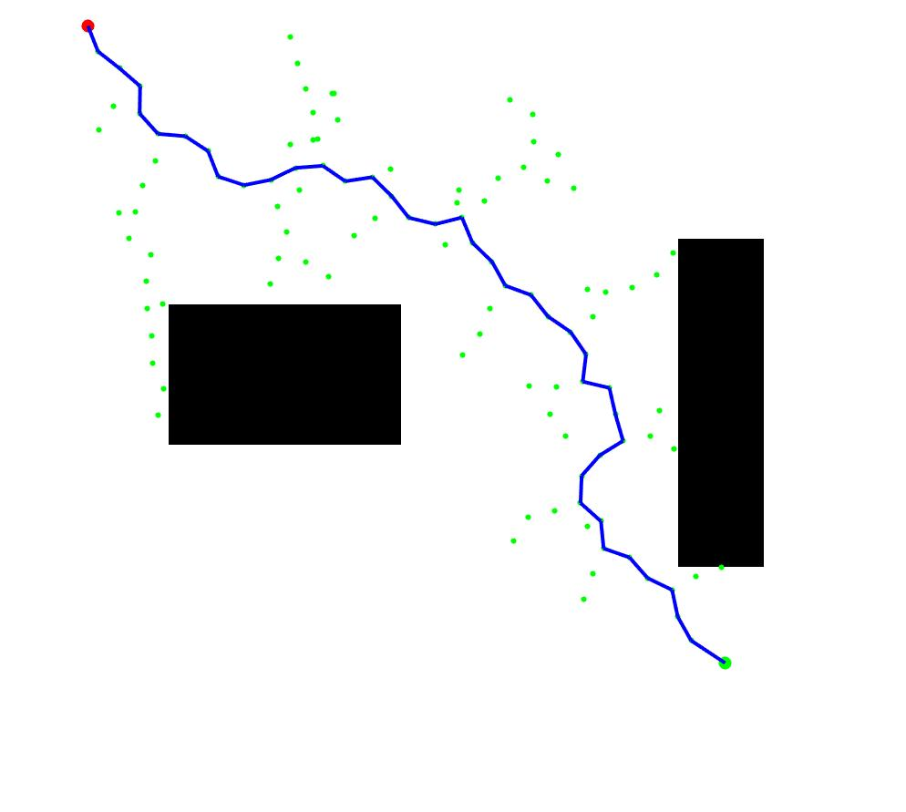

# Motion Planning for Mobile Robots -- 移动机器人运动规划: Path Finding, Sample Based

深蓝学院移动机器人运动规划第3节Path Finding, Sample Based作业框架.

---

## Overview

本作业旨在引导您:

* 基于MATLAB, 实现RRT Path Finding

---

## Up & Running

---

## Q1. 算法流程与运行结果

### RRT Star

**RRT Star**的运行结果如下:

* **Green**为RRT Exploration的结果
* **Blue**为查找到的Optimal Path

算法流程如下:

* [Step 1: Random Sample](https://github.com/AlexGeControl/Motion-Planning-for-Mobile-Robots/blob/bec0e77cc5868bd5df22414ac849c5318e343432/workspace/assignments/03-path-finding--sample-based/MATLAB/src/RRT.m#L43)
* [Step 2: Find Closest](https://github.com/AlexGeControl/Motion-Planning-for-Mobile-Robots/blob/bec0e77cc5868bd5df22414ac849c5318e343432/workspace/assignments/03-path-finding--sample-based/MATLAB/src/RRT.m#L49)
* [Step 3: Get Candidate New Node](https://github.com/AlexGeControl/Motion-Planning-for-Mobile-Robots/blob/bec0e77cc5868bd5df22414ac849c5318e343432/workspace/assignments/03-path-finding--sample-based/MATLAB/src/RRT.m#L66)
* [Step 4: Insert into Tree](https://github.com/AlexGeControl/Motion-Planning-for-Mobile-Robots/blob/bec0e77cc5868bd5df22414ac849c5318e343432/workspace/assignments/03-path-finding--sample-based/MATLAB/src/RRT.m#L79)
* [Step 5: Visualize](https://github.com/AlexGeControl/Motion-Planning-for-Mobile-Robots/blob/bec0e77cc5868bd5df22414ac849c5318e343432/workspace/assignments/03-path-finding--sample-based/MATLAB/src/RRT.m#L87)
* [Step 6: Goal Check](https://github.com/AlexGeControl/Motion-Planning-for-Mobile-Robots/blob/bec0e77cc5868bd5df22414ac849c5318e343432/workspace/assignments/03-path-finding--sample-based/MATLAB/src/RRT.m#L91)

---
