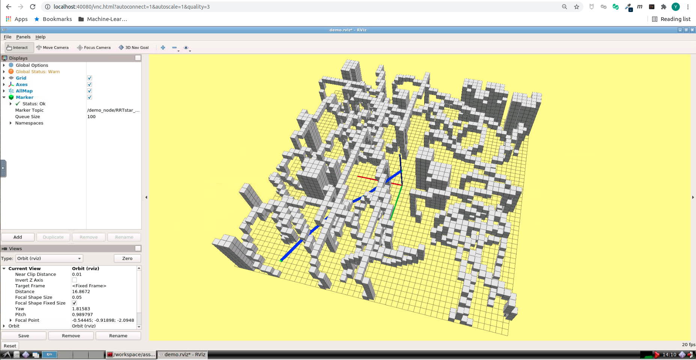

# Motion Planning for Mobile Robots -- 移动机器人运动规划: Path Finding, Sample Based

深蓝学院移动机器人运动规划第3节Path Finding, Sample Based作业框架.

---

## Overview

本作业旨在引导您:

* 基于OMPL, 实现RRT* Path Finding

---

## Up & Running

启动Docker后, 打开浏览器, 前往localhost:40080, 进入Web Workspace. **若需要提高清晰度, 可以更改URL中的quality参数**. 启动Terminator, 将两个Shell的工作目录切换如下:


在**上侧**的Shell中, 输入如下命令, **编译Search Based Path Finder**

```bash
# build
catkin_make
```

然后**启动解决方案**

```bash
# launch:
roslaunch grid_path_searcher demo.launch
```

最后, 点击**3D Nav Goal**, 发布**Termination Position**, 成功后, 可以看到如下的RViz界面:



---

## Q1. 算法流程与运行结果

### RRT Star

**RRT Star**的运行结果如下, 结果为使用**getPathLengthObjective**的结果


算法流程如下:

* [Step 1: Implement Validity Checker](https://github.com/AlexGeControl/Motion-Planning-for-Mobile-Robots/blob/113ce4a0f980cc0ced676fc3113991a26952bbf4/workspace/assignments/03-path-finding--sample-based/ROS/src/grid_path_searcher/src/grid_path_searcher/src/demo_node.cpp#L133)
* [Step 2: Define Start State](https://github.com/AlexGeControl/Motion-Planning-for-Mobile-Robots/blob/113ce4a0f980cc0ced676fc3113991a26952bbf4/workspace/assignments/03-path-finding--sample-based/ROS/src/grid_path_searcher/src/grid_path_searcher/src/demo_node.cpp#L185)
* [Step 3: Define Goal State](https://github.com/AlexGeControl/Motion-Planning-for-Mobile-Robots/blob/113ce4a0f980cc0ced676fc3113991a26952bbf4/workspace/assignments/03-path-finding--sample-based/ROS/src/grid_path_searcher/src/grid_path_searcher/src/demo_node.cpp#L193)
* [Step 4: Define Path Finding Problem](https://github.com/AlexGeControl/Motion-Planning-for-Mobile-Robots/blob/113ce4a0f980cc0ced676fc3113991a26952bbf4/workspace/assignments/03-path-finding--sample-based/ROS/src/grid_path_searcher/src/grid_path_searcher/src/demo_node.cpp#L201)
* [Step 5: Define Optimization Objective](https://github.com/AlexGeControl/Motion-Planning-for-Mobile-Robots/blob/113ce4a0f980cc0ced676fc3113991a26952bbf4/workspace/assignments/03-path-finding--sample-based/ROS/src/grid_path_searcher/src/grid_path_searcher/src/demo_node.cpp#L210)
* [Step 6: Set Optimizer](https://github.com/AlexGeControl/Motion-Planning-for-Mobile-Robots/blob/113ce4a0f980cc0ced676fc3113991a26952bbf4/workspace/assignments/03-path-finding--sample-based/ROS/src/grid_path_searcher/src/grid_path_searcher/src/demo_node.cpp#L218)
* [Step 7: Format Output](https://github.com/AlexGeControl/Motion-Planning-for-Mobile-Robots/blob/113ce4a0f980cc0ced676fc3113991a26952bbf4/workspace/assignments/03-path-finding--sample-based/ROS/src/grid_path_searcher/src/grid_path_searcher/src/demo_node.cpp#L243)

---
