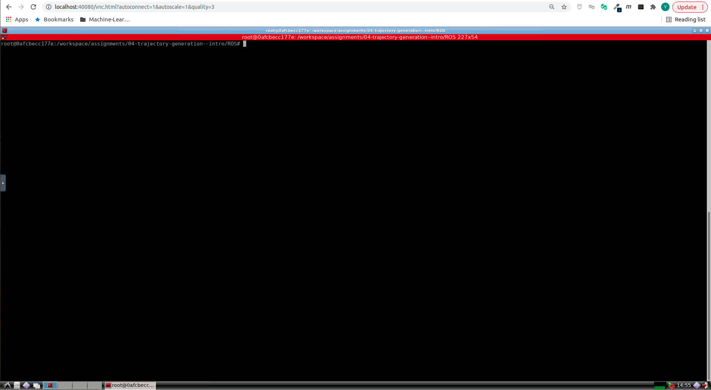
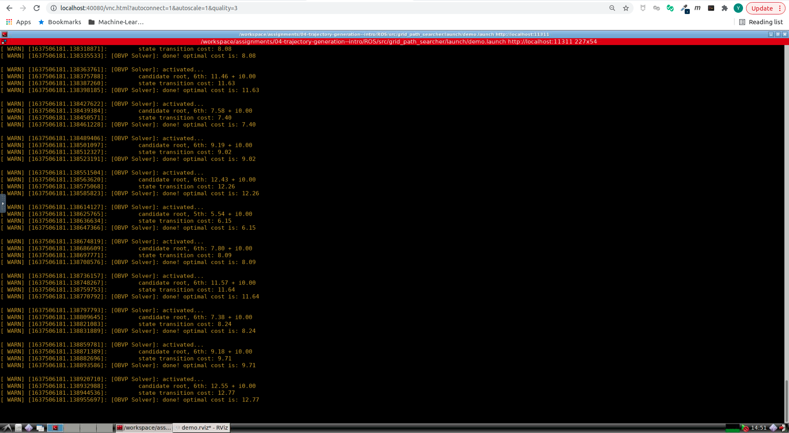

# Motion Planning for Mobile Robots -- 移动机器人运动规划: Optimal Boundary-Value Problem(OBVP)

深蓝学院移动机器人运动规划第4节Optimal Boundary-Value Problem(OBVP)作业框架.

---

## Overview

本作业旨在引导您:

* 基于SymPy, 实现OBVP Cost Function解析表达式的推导

* 基于C++ Eigen, 实现OBVP Cost Function极小值求解

---

## Up & Running

启动Docker后, 打开浏览器, 前往localhost:40080, 进入Web Workspace. **若需要提高清晰度, 可以更改URL中的quality参数**. 启动Terminator, 将两个Shell的工作目录切换如下:



在**上侧**的Shell中, 输入如下命令, **编译Search Based Path Finder**

```bash
# build
catkin_make
```

然后**启动解决方案**

```bash
# launch:
roslaunch grid_path_searcher demo.launch
```

最后, 点击**3D Nav Goal**, 发布**Termination Position**, 成功后, 可以看到如下的RViz界面:


---

## Q1. 算法流程与运行结果

### Analytic Expression of OBVP Cost Function

首先, 执行SymPy脚本, 获取Cost Function Derivative的解析表达式 [Click Here](scripts/get_optimal_cost_polynomial_params.py):

```bash
# get derivative coeffs:
python3 get_optimal_cost_polynomial_params.py
```

### OBVP Demo

**OVBP**的运行结果如下:




算法流程如下:

* [Step 0: OptimalBVP Implementation](https://github.com/AlexGeControl/Motion-Planning-for-Mobile-Robots/blob/206a2ba1076c6c7b2765fafb4f13801730941d74/workspace/assignments/04-trajectory-generation--intro/ROS/src/grid_path_searcher/src/hw_tool.cpp#L90)
* [Step 1: Forward Integration](https://github.com/AlexGeControl/Motion-Planning-for-Mobile-Robots/blob/206a2ba1076c6c7b2765fafb4f13801730941d74/workspace/assignments/04-trajectory-generation--intro/ROS/src/grid_path_searcher/src/demo_node.cpp#L153)
* [Step 2: Get OBVP Cost](https://github.com/AlexGeControl/Motion-Planning-for-Mobile-Robots/blob/206a2ba1076c6c7b2765fafb4f13801730941d74/workspace/assignments/04-trajectory-generation--intro/ROS/src/grid_path_searcher/src/demo_node.cpp#L167)

---
