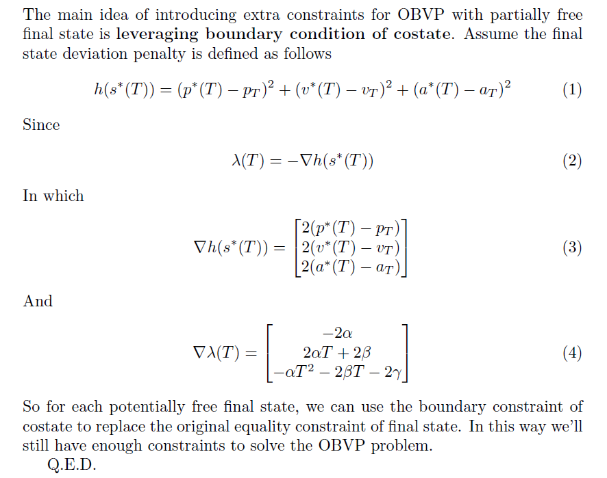

# Motion Planning for Mobile Robots -- Assignment 04 OBVP

Solution guide for **Assignment 04, Motion Planning for Mobile Robots**

---

## Q1 - OBVP for Partially-Free Final State

The main idea of **introducing extra constraints for partially-free final state is as follows**



---

## Q2 - OBVP C++ Solver

The implementation of OBVP C++ solver is as follows. 

**First**, get analytic expression of **the numerator derivative of objective function** with:

* **start & goal state** as **parameters**

* **state transition time T** as **decision parameter**

**NOTE**

* Here the **Numerator** of the objective function derivative is used. At optimal value it must equal to 0, which can be leveraged for efficient problem solving.

* Here **SymPy** is used to attain the analytic expression of objective function. The **sketch (You have to fill the missing details to get the snippet below working)** is as follows:

```python
# 
# step 1: solve for coeffs:
#
A = Matrix(
    [
        [-12/(T**3),          0,          0, 6/(T**2),       0,        0],
        [         0, -12/(T**3),          0,       0, 6/(T**2),        0],
        [         0,          0, -12/(T**3),       0,        0, 6/(T**2)],
        [  6/(T**2),          0,          0,    -2/T,        0,        0],
        [         0,   6/(T**2),          0,       0,     -2/T,        0],
        [         0,          0,   6/(T**2),       0,        0,     -2/T],
    ]
)
b = Transpose(
    Matrix(
        [
            [
                p_x_e - v_x_s*T - p_x_s, 
                p_y_e - v_y_s*T - p_y_s, 
                p_z_e - v_z_s*T - p_z_s, 
                          v_x_e - v_x_s, 
                          v_y_e - v_y_s, 
                          v_z_e - v_z_s,
            ]
        ]
    )
)
coeffs = simplify(A*b)

#
# step 2: build cost function
#
M = Matrix(
    [
        [(T**3)/3,        0,        0, (T**2)/2,        0,        0],
        [       0, (T**3)/3,        0,        0, (T**2)/2,        0],
        [       0,        0, (T**3)/3,        0,        0, (T**2)/2],
        [(T**2)/2,        0,        0,        T,        0,        0],
        [       0, (T**2)/2,        0,        0,        T,        0],
        [       0,        0, (T**2)/2,        0,        0,        T],
    ]
)

J = collect(
    expand(
        simplify(
            Transpose(coeffs) * M * coeffs
        )[0] + T
    ),
    syms=T
)

print(J)

#
# step 3: derivative
#
den = T**3
num = den * J

derivative = Poly(
    collect(
        expand(
            diff(num, T)*den - num*diff(den, T)
        ),
        syms=T
    ),
    T
)

#
# done:
#
for order, coeff in zip(
    range(len(derivative.all_coeffs()) - 1, -1, -1),
    derivative.all_coeffs()
):
    print(f"{order}: {coeff}\n")
```

**Then** implement the solver with the expression from SymPy. The **sketch (You have to fill the missing details to get the snippet below working)** is as follows:

```c++
    // define cost function:
    auto EvaluateCost = [&](const double T) {
        // TO-BE-FILLED:
        auto result = 0.0;

        return result / std::pow(T, 3);
    };
    


    // identify where the derivative of cost function equals to 0:
    Eigen::VectorXd coeffs(7);

    coeffs << 0.0,
           // 1st - TO-BE-FILLED:
           0.0,
           // 2nd - TO-BE-FILLED:
           0.0,
           // 3rd - TO-BE-FILLED:
           0.0,
           // 4th - TO-BE-FILLED: 
           0.0,
           // 5th - TO-BE-FILLED:
           0.0,
           // 6th - TO-BE-FILLED:
           0.0;

    //
    // here PolynomialSolver from eigen::unsupported is used:
    //
    Eigen::PolynomialSolver<double, Eigen::Dynamic> solver;
    solver.compute(coeffs);

    const Eigen::PolynomialSolver<double, Eigen::Dynamic>::RootsType &r = solver.roots();
    
    //
    // identify the optimal real root:
    //
    ROS_WARN("[OBVP Solver]: activated...");
    for (size_t i = 0; i < 6; ++i) {
        if (
            // positive real root only:
            (r(i).real() > epsilon) &&
            (std::abs(r(i).imag()) < epsilon)
        ) {
            // log root:
            ROS_WARN(
                "\tcandidate root, %dth: %.2f + i%.2f", 
                static_cast<int>(i + 1), 
                r(i).real(), 
                r(i).imag()
            );
            
            double curr_cost = EvaluateCost(r(i).real());

            // log cost:
            ROS_WARN(
                "\tstate transition cost: %.2f", curr_cost
            );

            if (curr_cost < optimal_cost) {
                optimal_cost = curr_cost;
            }
        }
        
    }
    ROS_WARN("[OBVP Solver]: done! optimal cost is: %.2f\n", optimal_cost);

    return optimal_cost;
}
```

---

## Wrap-Up

Happy Learning & Happy Coding!

Yao

* [GitHub](https://github.com/AlexGeControl/Motion-Planning-for-Mobile-Robots)

* [LinkedIn](https://www.linkedin.com/in/yao-ge-765315a0/)