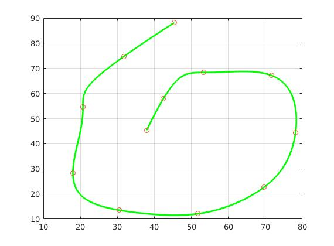

# Motion Planning for Mobile Robots -- 移动机器人运动规划: Trajectory Generation, Minimum Snap

深蓝学院移动机器人运动规划第5节Trajectory Generation, Minimum Snap作业框架.

---

## Overview

本作业旨在引导您:

* 基于MATLAB, 实现适用于Quadrotor的Minimum Snap Trajectory Numeric Generator
* 基于MATLAB, 实现适用于Quadrotor的Minimum Snap Trajectory Analytic Generator

---

## Q1. 算法流程与运行结果

### Minimum Snap

**Minimum Snap**的运行结果如下, **Numeric Solver**:

**Minimum Snap**的运行结果如下, **Analytic Solver**:

算法流程如下:

* **Step 1: Minimum Snap Solver**
    * [Step 1.1: Numeric Solver](https://github.com/AlexGeControl/Motion-Planning-for-Mobile-Robots/blob/61a8e5928a100ced138e426e62e7aa7096f8b0be/workspace/assignments/05-trajectory-generation--minimum-snap/MATLAB/numeric-solver.m)
        * [GetQ](https://github.com/AlexGeControl/Motion-Planning-for-Mobile-Robots/blob/61a8e5928a100ced138e426e62e7aa7096f8b0be/workspace/assignments/05-trajectory-generation--minimum-snap/MATLAB/getQ.m)
        * [GetAbeq](https://github.com/AlexGeControl/Motion-Planning-for-Mobile-Robots/blob/61a8e5928a100ced138e426e62e7aa7096f8b0be/workspace/assignments/05-trajectory-generation--minimum-snap/MATLAB/getAbeq.m)
    * [Step 1.2: Analytic Solver](https://github.com/AlexGeControl/Motion-Planning-for-Mobile-Robots/blob/61a8e5928a100ced138e426e62e7aa7096f8b0be/workspace/assignments/05-trajectory-generation--minimum-snap/MATLAB/analytic-solver.m)
        * [GetM](https://github.com/AlexGeControl/Motion-Planning-for-Mobile-Robots/blob/61a8e5928a100ced138e426e62e7aa7096f8b0be/workspace/assignments/05-trajectory-generation--minimum-snap/MATLAB/getM.m)
        * [GetCt](https://github.com/AlexGeControl/Motion-Planning-for-Mobile-Robots/blob/61a8e5928a100ced138e426e62e7aa7096f8b0be/workspace/assignments/05-trajectory-generation--minimum-snap/MATLAB/getCt.m)
---
