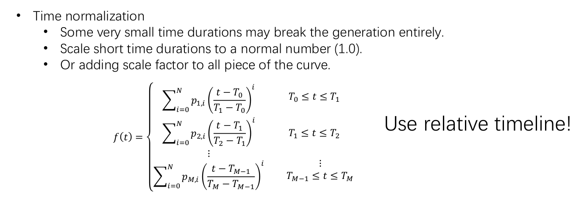
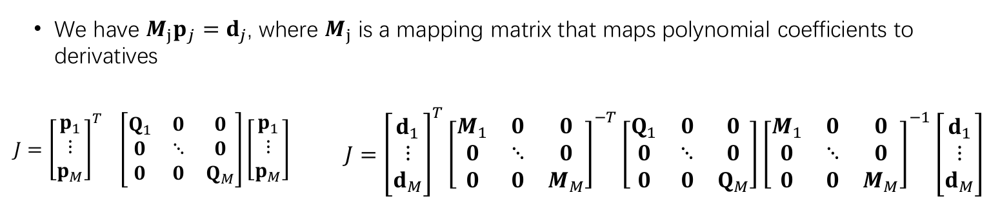
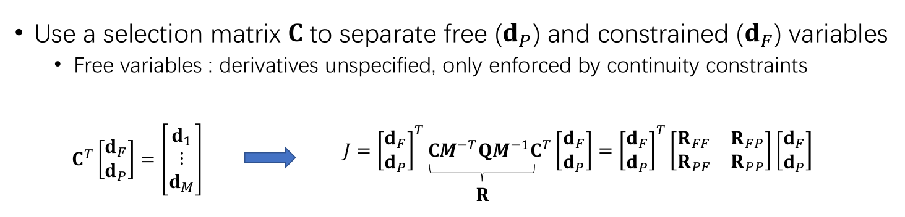

# Motion Planning for Mobile Robots -- Assignment 05 Minimum-Snap Trajectory Generation

**NOTE** Please open this in **VSCode** with **MATLAB plugin**

Solution guide for **Assignment 05, Minimum-Snap Trajectory Generation**. 

---

## Introduction

Welcome to **Solution Guide for Assignment 05**! Here I will guide you through the **MATLAB** implementations of both

* **Minimum-Snap Numeric Solver**

* **Minimum-Snap Analytic Solver**

---

## Q & A

Please send e-mail to alexgecontrol@qq.com with title **Motion-Planning-for-Mobile-Robots--Assignment-04--Q&A-[XXXX]**. I will respond to your questions at my earliest convenience.

**NOTE**

* I will **NOT** help you debug your code and will only give you suggestions on how should you do it on your own.

---

## Minimum-Snap, Numeric Solver

### Overview

The workflow of **numeric solver** can be summed up as follows:

* Build **objective matrix**, which is defined by **Minimum-Snap** or **Minimum-Jerk**

* Build **equality constraint matrix**, which is defined by:

    * **Boundary conditions**, **start** / **end** ego states

    * **Intermediate waypoint continuity**

* Solve the above **QP** problem 

* Use the result monomial coeffs. to generate the optimal trajectory

The workflow can be implemented in MATLAB as follows:

```matlab
% plan the minimum snap trajectory
poly_coef_x = MinimumSnapQPSolver(path(:, 1), ts, K, t_order);
poly_coef_y = MinimumSnapQPSolver(path(:, 2), ts, K, t_order);

% display the trajectory
X_n = [];
Y_n = [];
k = 1;
tstep = 0.01;
for i=0:K-1
    %#####################################################
    % STEP 3: get the coefficients of i-th segment
    %#####################################################
    % 1. get segment index:
    segment_index = (i*N + 1):((i+1)*N);
    % 2. extract segment coeffs:
    Pxi = flipud(poly_coef_x(segment_index));
    Pyi = flipud(poly_coef_y(segment_index));
    % 3. calculate planned waypoints:
    for t = 0:tstep:ts(i+1)
        X_n(k) = polyval(Pxi, t / ts(i + 1));
        Y_n(k) = polyval(Pyi, t / ts(i + 1));
        k = k + 1;
    end
end

% minimum snap trajectory generator:
function poly_coef = MinimumSnapQPSolver(waypoints, ts, K, t_order)
    start_cond = [waypoints(1), 0, 0, 0];
    end_cond   = [waypoints(end), 0, 0, 0];
    %#####################################################
    % TODO -- STEP 1: compute Q of p'Qp
    %#####################################################
    
    %#####################################################
    % TODO -- STEP 2: compute Aeq and beq 
    %#####################################################
    
    %#####################################################
    % TODO -- STEP 3: solve the problem with QP 
    %#####################################################

end
```

### Objective Matrix

The objective matrix is defined by **the L2-norm of the optimization target**:

* **Minimum Snap**, which is equivalent to **t_order = 4** in the implementation below

* **Minimum Jerk**, which is equivalent to **t_order = 3** in the implementation below

```matlab
function Q = getQ(K, t_order, ts)
    % num. of polynomial coeffs: 
    N = 2*t_order;
    
    % ###############################################
    % 1. pre-compute constants used in Q construction
    % ###############################################
    % 1.1 factorial from derivative
    Q_k = zeros(N - t_order);
    Q_v = zeros(N - t_order);
    for n = t_order:(N - 1)
        Q_k(n - t_order + 1) = n;
        Q_v(n - t_order + 1) = factorial(n) / factorial(n - t_order);
    end
    Q_factorial = containers.Map(Q_k, Q_v);
    
    % 1.2 time power:
    ts_power = ts .^ t_order;

    % ###############################################
    % 2. populate Q
    % ###############################################
    Q_i = [];
    Q_j = [];
    Q_v = [];
    
    index = 1;
    
    for k = 1:K
        for m = t_order:(N - 1)
            for n = t_order:(N - 1)
                % TODO -- fill in elements of Q
                
                index = index + 1;
            end
        end
    end
    
    Q = sparse(Q_i, Q_j, Q_v);
end
```

**Implementation Nodes**

* First, the above code uses **time normalization** to improve numeric stability



* Pay attention to the extra multiplication of **ts** introduced by change of variable in integration

* Here **sparse matrix** is used for efficient matrix manipulation. Please search the corresponding doc in MATLAB for details.

### Equality Constraint Matrix

The equality constraint matrix consists of following constraints:

* **Boundary Conditions**, which are defined by **start** and **end** states of target trajectory

* **Intermediate Waypoint Continuity**, which requires the planned trajectory should be **t_order - 1** order continuous at each intermediate waypoint

```matlab
function [Aeq, beq]= getAbeq(K, t_order, waypoints, ts, start_cond, end_cond)    
    % num. of polynomial coeffs:
    N = 2*t_order;
    
    % num. of constraints:
    C = (K + 1)*t_order + (K - 1);
    
    % ###############################################
    % 1. pre-compute constants used in A construction
    % ###############################################
    % 1.1 factorial from derivative
    A_factorial_k = [];
    A_factorial_v = [];
    
    index = 1;
    
    for c = 1:t_order
        for n = c:N
            A_factorial_k(index) = (c-1)*N + n - 1;
            A_factorial_v(index) = factorial(n - 1) / factorial(n - c);
            
            index = index + 1;
        end
    end
    A_factorial = containers.Map(A_factorial_k, A_factorial_v);
    
    % ###############################################
    % 2. populate A & b
    % ###############################################
    A_i = [];
    A_j = [];
    A_v = [];
    
    beq = zeros(C, 1);
    
    index = 1;
    c_index = 1;
    
    % 2.1 start & goal states:
    for c = 1:t_order
        % TODO -- fill in start state:
        index = index + 1;
        
        % move to next constraint:
        c_index = c_index + 1;
        
        % TODO -- fill in end state:
        for n = c:N
            index = index + 1;
        end
        
        % move to next constraint:
        c_index = c_index + 1;
    end
    
    % 2.2 intermediate waypoint passing constraints:
    for k = 1:(K - 1)
        % TODO -- next segment start position:
        index = index + 1;
        
        % TODO -- should equal to the specified value:
        
        % move to next constraint:
        c_index = c_index + 1;
    end
    
    % 2.3 intermediate waypoint continuity constraints:
    for c = 1:t_order
        for k = 1:(K - 1)
            % TODO -- current segment end state:
            for n = c:N
                index = index + 1;
            end
            
            % TODO -- should equal to next segment start state:
            index = index + 1;
            
            % move to next constraint:
            c_index = c_index + 1;
        end
    end
    
    Aeq = sparse(A_i, A_j, A_v);
end
```

**Implementation Nodes**

* According to the original paper, if your objective function is the L2-norm of **t_order** trajectory derivative, then the trajectory should be **t_order - 1** order continuous at each intermediate waypoint.

---

## Minimum-Snap, Analytic Solver

### Overview

The workflow of **analytic solver** can be summed up as follows:

* Build **objective matrix**, which is defined by **Minimum-Snap** or **Minimum-Jerk**. This is the same as previous question.

* Map **equality constraints** to **actual decision variables**: 

    * The **equality constraints** are the same as previous question

    * The **actual decision variables** are the **t_order - 1** derivatives at the start and end of each trajectory segment

* Solve the above **least square** problem.

* Map the optimal decision variables to monomial coeffs.

* Use the result monomial coeffs. to generate the optimal trajectory

The workflow can be implemented in MATLAB as follows:

```matlab
% minimum snap trajectory generator:
function poly_coef = MinimumSnapCloseformSolver(waypoints, ts, K, t_order)
    start_cond = [waypoints(1), 0, 0, 0];
    end_cond =   [waypoints(end), 0, 0, 0];
    %#####################################################
    % TODO -- STEP 1: compute Q of p'Qp
    %#####################################################

    %#####################################################
    % TODO -- STEP 2: compute M
    %#####################################################
    
    %#####################################################
    % TODO -- STEP 3: compute C
    %#####################################################
    
    %#####################################################
    % TODO -- STEP 4: solve unconstrained optimization
    %#####################################################
    
    % TODO -- 4.1 set boundary waypoints (start & end) states
    D = 2*t_order + (K - 1);
    N = (K+1)*t_order;
    
    d_fixed = zeros(D, 1);
    for c = 1:t_order
        ;
    end
    % TODO -- 4.2 set intermediate waypoint positions:
    for k = 2:K
        ;
    end
    
    % TODO -- 4.3 solve least squared:

    %#####################################################
    % TODO -- STEP 5: restore poly coef
    %#####################################################

end
```

### Mapping Equality Constraints to Actual Decision Variables

The main idea is summarized exactly by the 2 pictures below:





The implementation of the first part, **monomial coeffs** to **decision variables**, are as follows:

```matlab
function M = getM(K, t_order, ts)
    % num. of polynomial coeffs:
    N = 2*t_order;
        
    % ###############################################
    % 1. pre-compute constants used in M construction
    % ###############################################
    % 1.1 factorial from derivative
    M_factorial_k = [];
    M_factorial_v = [];
    
    index = 1;
    
    for c = 1:t_order
        for n = c:N
            M_factorial_k(index) = (c-1)*N + n - 1;
            M_factorial_v(index) = factorial(n - 1) / factorial(n - c);
            
            index = index + 1;
        end
    end
    M_factorial = containers.Map(M_factorial_k, M_factorial_v);
    
    % ###############################################
    % 2. populate M
    % ###############################################
    M_i = [];
    M_j = [];
    M_v = [];
    
    index = 1;
    c_index = 1;
        
    % calculate the start & end states of each trajectory segment:
    for k = 1:K
        for c = 1:t_order
            % TODO -- current segment start state:
            index = index + 1;
            % move to next constraint:
            c_index = c_index + 1;
        end
        
        for c = 1:t_order
            % TODO -- current segment end state:
            for n = c:N
                index = index + 1;
            end
            % move to next constraint:
            c_index = c_index + 1;
        end
    end
    
    M = sparse(M_i, M_j, M_v);
end
```

The implementation of the second part, **equality-constraints** to **decision variables**, are as follows:

```matlab
function C = getC(K, t_order)
    % num. of decision variables:
    D = (K + 1)*t_order;
    
    C_i = [];
    C_j = [];
    C_v = [];
    
    index = 1;
    c_index = 1;
    
    % ###############################################
    % 1. select fixed variables
    % ###############################################
    for c = 1:t_order
        % TODO -- first trajectory segment:
        index = index + 1;
        
        % move to next decision variable:
        c_index = c_index + 1;
        
        % TODO -- last trajectory segment:
        index = index + 1;
        
        % move to next decision variable:
        c_index = c_index + 1;
    end

    % ###############################################
    % 2. select free variables
    % ###############################################
    for c = 1:t_order
        for k = 1:(K - 1)
            % TODO -- current trajectory segment end state:
            index = index + 1;
        
            % TODO -- should equal to next trajectory segment start state:
            index = index + 1;
        
            % move to next decision variable:
            c_index = c_index + 1;
        end
    end
    
    C = sparse(C_i, C_j, C_v);
end
```

**Implementation Nodes**

* The decision variables are organized as follows. Here assumes **K = 2** and **t_order = 3**

```matlab
decision_variables = [
    % start pos:
    pos(1);
    % end pos:
    pos(K + 1);
    % start vel:
    vel(1);
    % end vel:
    vel(K + 1);
    % start acc:
    acc(1);
    % end acc:
    acc(K + 1);

    % intermediate waypoint pos:
    pos(2);
    ...
    pos(K);
    % intermediate waypoint vel:
    vel(2);
    ...
    vel(K);
    % intermediate waypoint acc:
    acc(2);
    ...
    acc(K);
];
```

---

## Wrap-Up

Happy Learning & Happy Coding!

Yao

* [GitHub](https://github.com/AlexGeControl/Motion-Planning-for-Mobile-Robots)

* [LinkedIn](https://www.linkedin.com/in/yao-ge-765315a0/)