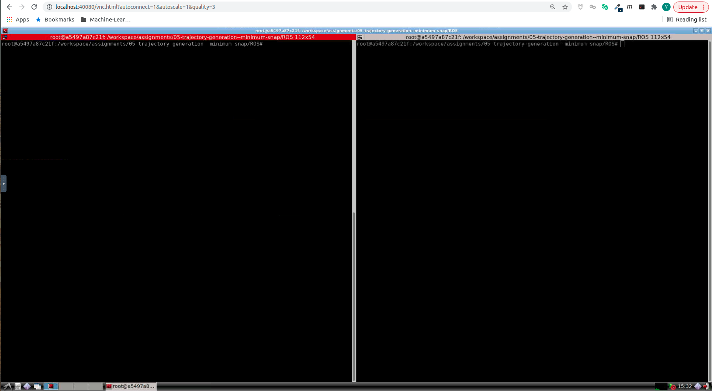
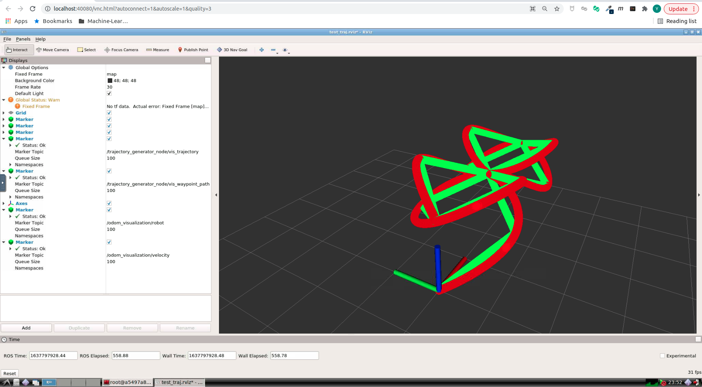
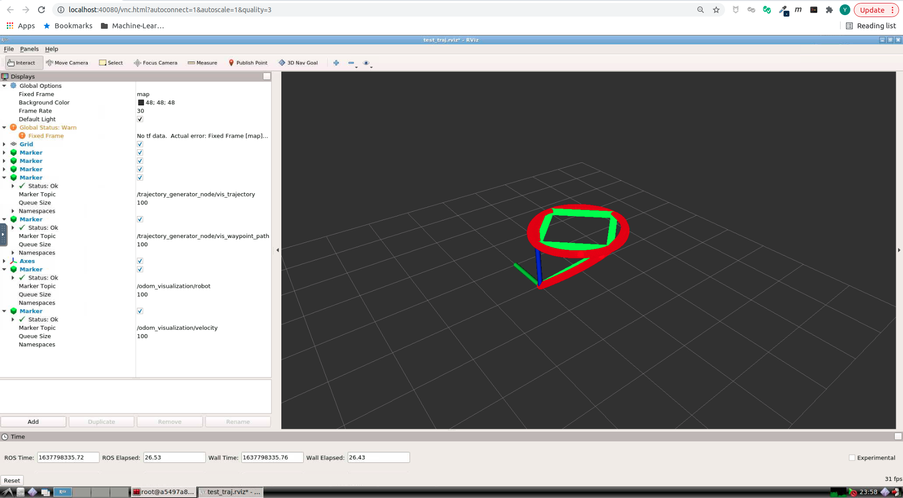

# Motion Planning for Mobile Robots -- 移动机器人运动规划: Trajectory Generation, Minimum Snap

深蓝学院移动机器人运动规划第5节Trajectory Generation, Minimum Snap作业框架.

---

## Overview

本作业旨在引导您:

* 基于OSQP, 实现适用于Quadrotor的Minimum Snap Trajectory Generation

---

## Up & Running

启动Docker后, 打开浏览器, 前往localhost:40080, 进入Web Workspace. **若需要提高清晰度, 可以更改URL中的quality参数**. 启动Terminator, 将两个Shell的工作目录切换如下:



在**左侧**的Shell中, 输入如下命令, **编译Search Based Path Finder**

```bash
# build
catkin_make
```

然后**启动解决方案**

```bash
# set up session:
source devel/setup.bash
# launch:
roslaunch waypoint_trajectory_generator test.launch 
```

随后在**右侧**的Shell中, 输入如下命令, **发布随机的Coarse Path, 触发Trajectory Optimization**
```bash
# set up session:
source devel/setup.bash

# publish coarse path - set waypoint_type to manual
./src/waypoint_trajectory_generator/scripts/publish_waypoints.sh

# or just publish stop waypoint for fast debugging - set waypoint_type to circle or eight:
./src/waypoint_trajectory_generator/scripts/publish_stop_waypoint.sh
```
---

## Q1. 算法流程与运行结果

### Minimum Snap

**Minimum Snap**的运行结果如下, **Eight Waypoints Set**:



**Minimum Snap**的运行结果如下, **Circle Waypoints Set**:



算法流程如下:

* [Step 1: Time Allocation](https://github.com/AlexGeControl/Motion-Planning-for-Mobile-Robots/blob/206a2ba1076c6c7b2765fafb4f13801730941d74/workspace/assignments/05-trajectory-generation--minimum-snap/ROS/src/waypoint_trajectory_generator/src/trajectory_generator_node.cpp#L442)
    * [Step 1.1: Time Allocation, Segment Trapezoidal](https://github.com/AlexGeControl/Motion-Planning-for-Mobile-Robots/blob/206a2ba1076c6c7b2765fafb4f13801730941d74/workspace/assignments/05-trajectory-generation--minimum-snap/ROS/src/waypoint_trajectory_generator/src/trajectory_generator_node.cpp#L385)
    * [Step 1.2: Time Allocation, Global Trapezoidal](https://github.com/AlexGeControl/Motion-Planning-for-Mobile-Robots/blob/206a2ba1076c6c7b2765fafb4f13801730941d74/workspace/assignments/05-trajectory-generation--minimum-snap/ROS/src/waypoint_trajectory_generator/src/trajectory_generator_node.cpp#L284)
* [Step 2: Minimum Snap Solver Interface](https://github.com/AlexGeControl/Motion-Planning-for-Mobile-Robots/blob/206a2ba1076c6c7b2765fafb4f13801730941d74/workspace/assignments/05-trajectory-generation--minimum-snap/ROS/src/waypoint_trajectory_generator/src/trajectory_generator_waypoint.cpp#L30)
    * [Step 2.1: Numeric Solver with OSQP](https://github.com/AlexGeControl/Motion-Planning-for-Mobile-Robots/blob/206a2ba1076c6c7b2765fafb4f13801730941d74/workspace/assignments/05-trajectory-generation--minimum-snap/ROS/src/waypoint_trajectory_generator/src/trajectory_generator_waypoint.cpp#L81)
    * [Step 2.1: Analytic Solver](https://github.com/AlexGeControl/Motion-Planning-for-Mobile-Robots/blob/206a2ba1076c6c7b2765fafb4f13801730941d74/workspace/assignments/05-trajectory-generation--minimum-snap/ROS/src/waypoint_trajectory_generator/src/trajectory_generator_waypoint.cpp#L81)

---
