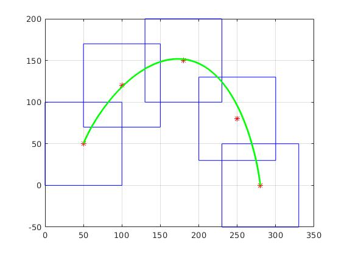

# Motion Planning for Mobile Robots -- 移动机器人运动规划: Trajectory Generation, Collision Avoidance

深蓝学院移动机器人运动规划第6节Trajectory Generation, Collision Avoidance作业框架.

---

## Overview

本作业旨在引导您:

* 基于MATLAB, 实现基于Bezier Curve的Flight Corridor Quadrotor Navigation.

---

## Q1. 算法流程与运行结果

算法的运行结果如下:

算法流程如下:

* [QP Solver for Bezier Curve Based Flight Corridor Navigation](https://github.com/AlexGeControl/Motion-Planning-for-Mobile-Robots/blob/928ecf979b0f867c640e13a903b903242dca6a62/workspace/assignments/06-trajectory-generation--constraints/MATLAB/src/numericSolver.m#L83)
    * [Step 1: Build Objective Matrix](https://github.com/AlexGeControl/Motion-Planning-for-Mobile-Robots/blob/928ecf979b0f867c640e13a903b903242dca6a62/workspace/assignments/06-trajectory-generation--constraints/MATLAB/src/getPM.m#L1)
        * [1.1: Build Objective Matrix for Minimum Jerk/Snap](https://github.com/AlexGeControl/Motion-Planning-for-Mobile-Robots/blob/928ecf979b0f867c640e13a903b903242dca6a62/workspace/assignments/06-trajectory-generation--constraints/MATLAB/src/getQ.m#L1)
        * [1.2: Build Transform Matrix, Bernstein to Monomial](https://github.com/AlexGeControl/Motion-Planning-for-Mobile-Robots/blob/928ecf979b0f867c640e13a903b903242dca6a62/workspace/assignments/06-trajectory-generation--constraints/MATLAB/src/getM.m#L1)
    * [Step 2: Build Constraint Matrix, Equality](https://github.com/AlexGeControl/Motion-Planning-for-Mobile-Robots/blob/928ecf979b0f867c640e13a903b903242dca6a62/workspace/assignments/06-trajectory-generation--constraints/MATLAB/src/getAbeq.m#L1)
    * [Step 3: Build Constraint Matrix, In-equality](https://github.com/AlexGeControl/Motion-Planning-for-Mobile-Robots/blob/928ecf979b0f867c640e13a903b903242dca6a62/workspace/assignments/06-trajectory-generation--constraints/MATLAB/src/getAbieq.m#L1)
    * [Step 4: Transform Bezier Coeffs to Monomial Coeffs](https://github.com/AlexGeControl/Motion-Planning-for-Mobile-Robots/blob/928ecf979b0f867c640e13a903b903242dca6a62/workspace/assignments/06-trajectory-generation--constraints/MATLAB/src/numericSolver.m#L110)
    
---