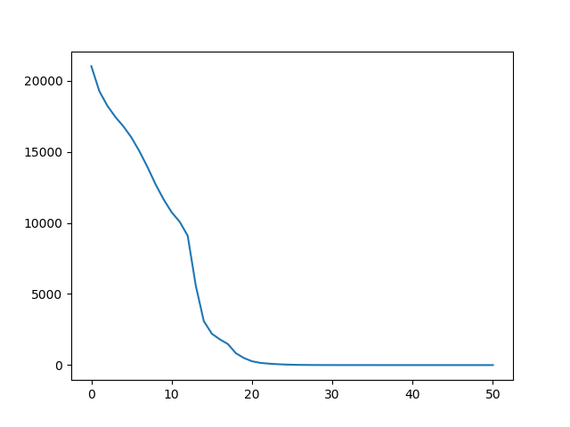
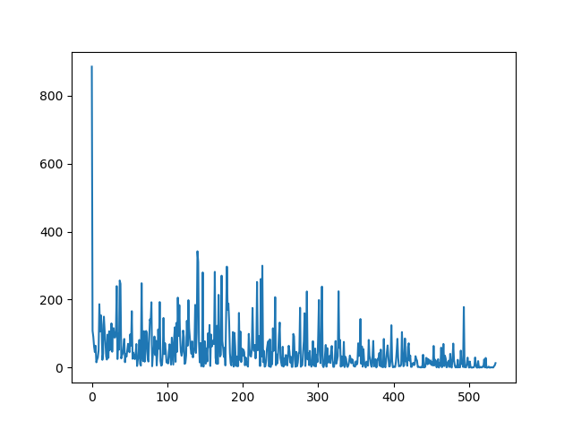
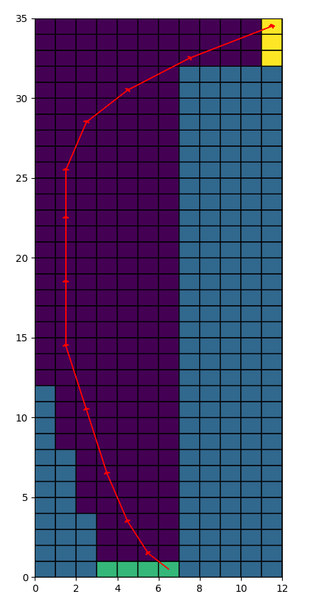

# Motion Planning for Mobile Robots -- 移动机器人运动规划: Real-Time Dynamic Programming

深蓝学院移动机器人运动规划第7节Real-Time Dynamic Programming作业框架.
---

## Overview

本作业旨在引导您:

* 基于Python, 实现基于Real-Time Dynamic Programming的Sim Car Racing

---

## Q1. 算法流程与运行结果

算法的运行结果如下:

Value-Iteration DP         |Real-Time DP
:-------------------------:|:-------------------------:
  |  
  |  

算法收敛时，总计更新的Graph Node的统计如下表所示:

|      Algo.      | Value-Iteration DP | Real-Time DP | Performance Boost |
|:---------------:|:------------------:|:------------:|:-----------------:|
| Nodes Evaluated |       946,356      |    64,847    |       1460%       |

相比**Value-Iteration**, **Real-Time**策略使算法的收敛速度提升了**1500%**

算法实现请参考[Here](real_time_dynamic_programming.py)

---