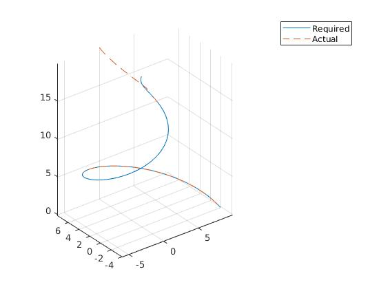
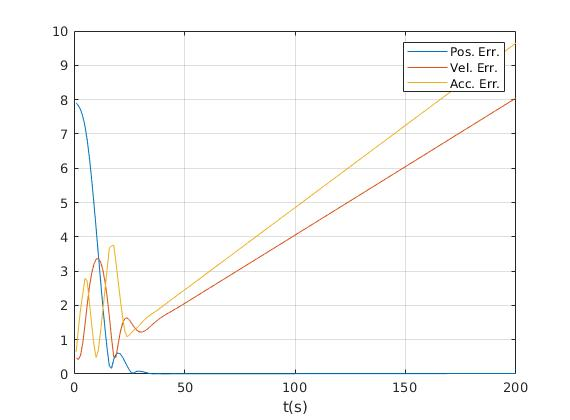

# Motion Planning for Mobile Robots -- 移动机器人运动规划: Conical Spiral Tracking, Model Predictive Control

深蓝学院移动机器人运动规划第8节Conical Spiral Tracking, Model Predictive Control作业框架.
---

## Overview

本作业旨在引导您:

* 基于MATLAB, 实现基于Model Predictive Control的Conical Spiral Tracking

---

## Q1. 算法流程与运行结果

算法的运行结果如下:

Result Trajectory          |Tracking Errors
:-------------------------:|:-------------------------:
  |  

所使用的[Control Params](linear_mpc_tracking.m)如下:

|   Param.   |                    Meaning                    |  Value  |
|:----------:|:---------------------------------------------:|:-------:|
|     dt     |            MPC prediction interval            |   0.2   |
|      K     |             MPC prediction horizon            |    20   |
|    wPos    |   objective function weight, position error   |   50.0  |
|    wVel    |   objective function weight, velocity error   |   2.0   |
|    wAcc    | objective function weight, acceleration error |   2.0   |
|    wJer    |   objective function weight, jerk magnitude   |   0.5   |
| vxy_limits |              velocity limits, X-Y             | [-6,+6] |
| axy_limits |            acceleration limits, X-Y           | [-3,+3] |
| jxy_limits |                jerk limits, X-Y               | [-3,+3] |
|  vz_limits |               velocity limits, Z              | [-1,+6] |
|  az_limits |             acceleration limits, Z            | [-1,+3] |
|  jz_limits |                 jerk limits, Z                | [-2,+2] |

算法实现请参考[Here](linear_mpc_tracking.m)

---