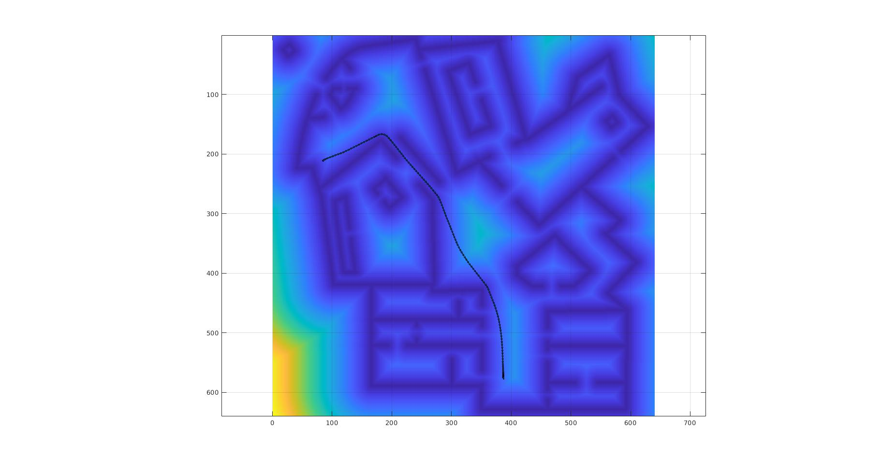
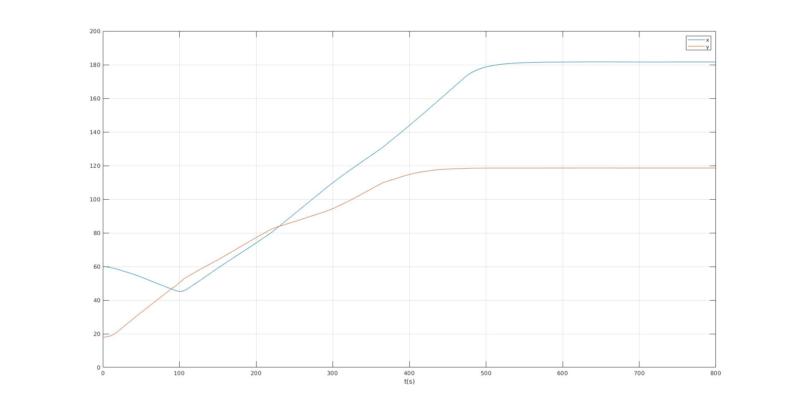
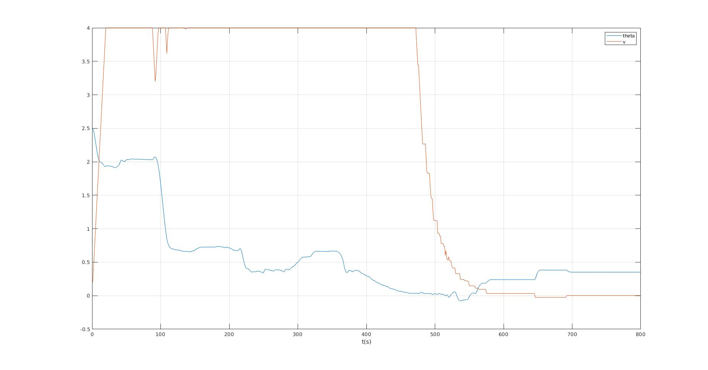

# Motion Planning for Mobile Robots -- 移动机器人运动规划: Differential Drive Vehicle Navigation with NN Scorer & MPC, Model Predictive Control

深蓝学院移动机器人运动规划第8节Differential Drive Vehicle Navigation with NN Scorer & MPC, Model Predictive Control作业框架.
---

## Overview

本作业旨在引导您:

* 基于MATLAB, 实现基于NN Scorer & Model Predictive Control的Differential Drive Vehicle Navigation

---

## Q1. 算法流程与运行结果

算法的运行结果如下:

Trajectory, Spatial        |Trajectory, Temporal
:-------------------------:|:-------------------------:
  |  

所获得的最优控制序列如下:

算法实现请参考[Here](pso/pso_navigation.m)

---