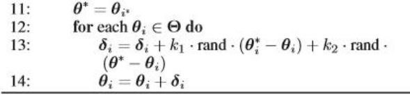

# Motion Planning for Mobile Robots -- Assignment 08 Model Predictive Control

**NOTE** Please open this in **VSCode** with **MATLAB plugin**

Solution guide for **Assignment 08, Model Predictive Control**. 

---

## Introduction

Welcome to **Solution Guide for Assignment 08**! Here I will guide you through the **MATLAB** implementations of

* **08 Model Predictive Control**

---

## Q & A

Please send e-mail to alexgecontrol@qq.com with title **Motion-Planning-for-Mobile-Robots--Assignment-08--Q&A-[XXXX]**. I will respond to your questions at my earliest convenience.

**NOTE**

* I will **NOT** help you debug your code and will only give you suggestions on how should you do it on your own.

---

## Q1 -- MPC for Tracking

### Overview

The main idea of this question is: format the objective for **tracking** rather than **returning to zero**.

### Reference Implementation

I have refactored the workflow as follows. I believe you can implement it with ease through following my comments.

```matlab
% ###############################################
% problem specification
% ###############################################
T     = 40;
dt    = 0.2;                 % time interval
K     = 20;                  % prediction horizon

w_pos = 100.0;               % position tracking weight
w_vel =   1.0;               % velocity trackng weight
w_acc =   1.0;               % acceleration tracking weight
w_jer =   1.0;               % control strength regulation

vel_limits = [
    [-6, +6];
    [-6, +6];
    [-1, +6]; 
]';                          % velocity limits
acc_limits = [
    [-3, +3];
    [-3, +3];
    [-1, +3];
]';                          % acceleration limits
jer_limits = [
    [-3, +3];
    [-3, +3];
    [-2, +2];
]';                          % jerk limits

% ###############################################
% solve problem
% ###############################################
% output trajectory:
N = (T / dt);
state_index = 1;

timestamps = zeros(N, 1);

P_act = zeros(N, 3);
V_act = zeros(N, 3);
A_act = zeros(N, 3);

P_req = zeros(N, 3);
V_req = zeros(N, 3);
A_req = zeros(N, 3);

% define init state:
p_0 = [0 8 20];
v_0 = [0 0  0];
a_0 = [0 0  0];

for t = 0.2:dt:40
    % ###############################################
    % identify target trajectory ahead
    % ###############################################
    pt = zeros(K, 3);
    vt = zeros(K, 3);
    at = zeros(K, 3);
    for i = 1:K
        tref = t + i*dt;
        r=0.25*tref;
        pt(i,1) =  r*sin(0.2*tref);
        vt(i,1) =  r*cos(0.2*tref);
        at(i,1) = -r*sin(0.2*tref);
        
        pt(i,2) =  r*cos(0.2*tref);
        vt(i,2) = -r*sin(0.2*tref);
        at(i,2) = -r*cos(0.2*tref);
        
        pt(i,3) = 20 - 0.5*tref;
        vt(i,3) = -0.5;
        at(i,3) = 0;
    end

    % ###############################################
    % solve MPC
    % ###############################################
    J = zeros(K, 3);
    for i = 1:3 
        % TODO -- get prediction matrix:

        % TODO -- build objective function:
        % H = [];
        % f = [];

        % TODO -- build constraint matrix:
        % A_ieq = [];
        % b_ieq = [];

        % TODO -- solve the problem:
    end

    % ###############################################
    % TODO -- apply optimal control
    % ###############################################
    j = J(1, :);
    for i = 1:3
       [p_0(i),v_0(i),a_0(i)] = forward(p_0(i),v_0(i),a_0(i),j(i),dt);
    end

    % log the states:
    timestamps(state_index) = state_index;

    P_act(state_index, :) = p_0;
    V_act(state_index, :) = v_0;
    A_act(state_index, :) = a_0;

    P_req(state_index, :) = pt(1, :);
    V_req(state_index, :) = vt(1, :);
    A_req(state_index, :) = at(1, :);

    state_index = state_index + 1;
end
```

---

## Q2 -- PSO

### Overview

The main idea of this question is summarized in the picture below. You just need to follow the pseudo-code and implement the update part of PSO.



### Reference Implementation

I have refactored the workflow as follows. I believe you can implement it with ease through following my comments. Please pay attention to the data structure **particle**, this is the only difficult point of this question.

```matlab
    %==========================================================================
    % do PSO
    %==========================================================================
    for j=1:batch
        for i=1:N
            w = 0.95 - (0.95-0.4)/batch*j;

            if (j~=1)
                % TODO -- get delta:

                % TODO -- update state
            end
            
            % evaluate the particle:
            cost = evaluate(R,t,omega,particle(i,1),last_theta_target-theta,v,particle(i,2));
            
            % update the local best
            if cost < particle(i,7)
                particle(i,7) = cost;
                particle(i,5)=particle(i,1);
                particle(i,6)=particle(i,2);
            end
            
            % update the global best
            if cost < global_best(3)
                global_best(3)=cost;
                global_best(1)=particle(i,1);
                global_best(2)=particle(i,2);
            end
        end
    end
    global_best(1) = global_best(1) + theta;
```

---

## Wrap-Up

Happy Learning & Happy Coding!

Yao

* [GitHub](https://github.com/AlexGeControl/Motion-Planning-for-Mobile-Robots)

* [LinkedIn](https://www.linkedin.com/in/yao-ge-765315a0/)