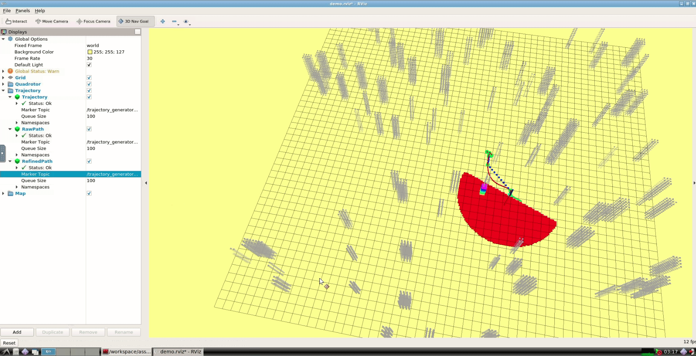

# Motion Planning for Mobile Robots -- 移动机器人运动规划: Capstone, Quadrotor Navigation

深蓝学院移动机器人运动规划大作业框架.

---

## Overview

本作业旨在引导您:

* 基于ROS C++, 实现完整的Quadrotor Motion Planning Pipeline

---

## Up & Running

启动Docker后, 打开浏览器, 前往localhost:40080, 进入Web Workspace. **若需要提高清晰度, 可以更改URL中的quality参数**. 启动Terminator, 将两个Shell的工作目录切换如下:


在**左侧**的Shell中, 输入如下命令, **编译Search Based Path Finder**

```bash
# build
catkin_make
```

然后**启动解决方案**:

```bash
# set up session:
source devel/setup.bash
# launch:
roslaunch trajectory_generator demo.launch 
```

随后在**RViz**中, 通过**3D Nav Goal**插件, 发布导航目标点, 触发运动规划. **Demo运行结果如下**



---

## Q1. Motion Planning Pipeline Workflow

整个Pipeline由如下的**State Machine**进行管理:


其中Motion Planning核心算法流程如下:

1. **Path Finding with A Star** [Implementation Here]()
2. **Simplify Path with RDF** [Implementation Here]()
3. **Trajectory Optimization with Collision Check**
   1. **Trajectory Optimization through Minimum Jerk Piecewise Monomial** [Implementation Here]()
   2. **Collision Check** [Implementation Here]()
   3. **Mid-Waypoint Update for First Unsafe Segment** [Implementation Here]()
   
---
