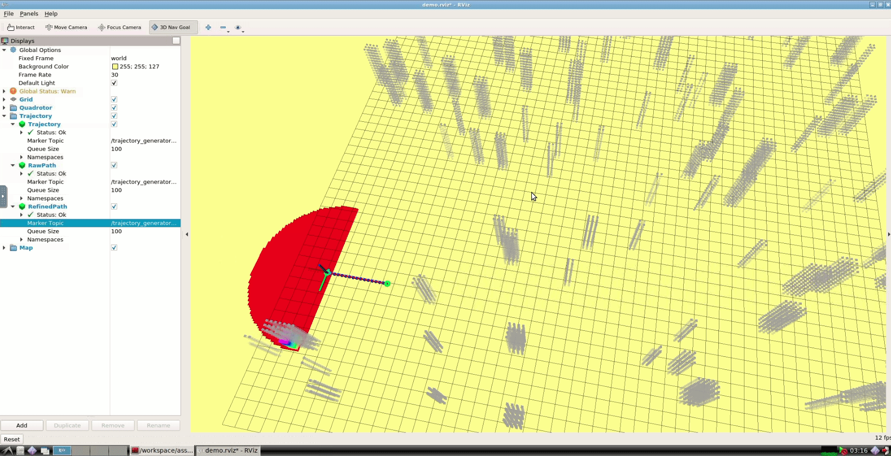

# Motion Planning for Mobile Robots -- Capstone, Quadrotor Navigation

**NOTE** Please open this in **VSCode** with **Markdown & C++ plugin**

Solution guide for **Capstone, Quadrotor Navigation**. 

---

## Introduction

Welcome to **Solution Guide for Capstone, Quadrotor Navigation**! Here I will guide you through the **ROS C++** implementations of

* **Quadrotor Navigation**

---

## Q & A

Please send e-mail to alexgecontrol@qq.com with title **Motion-Planning-for-Mobile-Robots--Capstone--Q&A-[XXXX]**. I will respond to your questions at my earliest convenience.

**NOTE**

* I will **NOT** help you debug your code and will only give you suggestions on how should you do it on your own.

---

## Overview

The roadmap of this capstone project is as follows:

1. Integrate your solution to [Chp 2. Search Based Path Finding](https://github.com/AlexGeControl/Motion-Planning-for-Mobile-Robots/tree/main/workspace/assignments/02-path-finding--search-based/ROS) as the required **A star** implementation.
2. Integrate your solution to:
   1. [Chp 4. Kinodynamics Based Path Finding](https://github.com/AlexGeControl/Motion-Planning-for-Mobile-Robots/tree/main/workspace/assignments/04-trajectory-generation--obvp) as the required **trajectory optimizer** for **single trajectory segment optimization, K = 1**. This is a **MUST** because RDP could generate simplified path that contains only **2** waypoints, which will crash the minimum snap trajectory optimizer.
   2. [Chp 5. Minimum Snap Trajectory Optimization](https://github.com/AlexGeControl/Motion-Planning-for-Mobile-Robots/tree/main/workspace/assignments/05-trajectory-generation--minimum-snap/ROS) as the required **trajectory optimizer** for **multiple trajectory segment optimization, K = 2**

With the above three assignment solutions, you should be able to generate valid trajectory to navigate your quadrotor around in free space, which indicats you have reached **the first checkpoint**, as it is shown in the GIF below.



Then continue to implement **RDP based path simplification** and **iterative path refinement** as follows

1. For **RDP**, you just need to follow the pseudo-code from [Wikipedia](https://en.wikipedia.org/wiki/Ramer%E2%80%93Douglas%E2%80%93Peucker_algorithm) and implement it in C++. For validation you should add a new trajectory publisher, as shown in the above demo as the waypoints in **GREEN** so as to compare the outputs of different sub modules:
   1. **BLUE** results from search-based path finding
   2. **GREEN** simplified path
   3. **RED** planned trajectory from optimizer

2. For **iterative path refinement**, you just need to follow the idea from the recommended paper and implement corresponding algorithm. One reference implementation in pseudo-code is as follows:

```Python
    while True:
        # do trajectory optimization on refined waypoints:
        optimized_trajectory = optimize_trajectory(refined_waypoint_indices)

        # identify the first trajectory segment that collides with obstacles
        unsafe_trajectory_segment_index = do_collision_check(optimized_trajectory)

        # collision found:
        if unsafe_trajectory_segment_index >= 0:
            # find middle waypoint index, raw A star path:
            mid_waypoint_index = get_mid_waypoint_index(unsafe_trajectory_segment_index, refined_waypoint_indices)

            # insert it into refined waypoints:
            refined_waypoint_indices = refine_waypoints(mid_waypoint_index, refined_waypoint_indices)
        else:
            break
```

With the above 2 refinements properly implemented, your quadrotor should be able to avoid the obstacle during navigation, which indicats you have reached **the second checkpoint**, as it is shown in the GIF below. 


---

## Wrap-Up

Happy Learning & Happy Coding!

Yao

* [GitHub](https://github.com/AlexGeControl/Motion-Planning-for-Mobile-Robots)

* [LinkedIn](https://www.linkedin.com/in/yao-ge-765315a0/)